### Hi there, I'm Hugo 👋

## I'm a Developer making my way through code!!

- 🌱 I’m currently improving in Java and React, and especially code architecture
- 👯 I’m looking to collaborate and contribute to Open Source projects
- ⚡ Fun fact: I love to play video games, travel and do some mountaineering

### Languages and Tools:

<a href="#">
<a href="#">
<a href="#">
<a href="#">
<a href="#">
<a href="#">
<a href="#">
<a href="#">
<a href="#">
 

### Connect with me:

[][linkedin]

 

---

  
:zap: Recent GitHub Activity

  
<!--START_SECTION:activity-->
1. ❌ Closed PR [#641](https://github.com/hdescottes/StockMarketDashboard/pull/641) in [hdescottes/StockMarketDashboard](https://github.com/hdescottes/StockMarketDashboard)
2. 💪 Opened PR [#107](https://github.com/hdescottes/SamusProgressBar/pull/107) in [hdescottes/SamusProgressBar](https://github.com/hdescottes/SamusProgressBar)
<!--END_SECTION:activity-->

  
:zap: GitHub Stats

  

  
:zap: Top Languages

  
  

[linkedin]: https://www.linkedin.com/in/hugo-descottes
